# AVIBA - Application Flowcharts

## 1. Main Application Flow

## 2. Public User Journey Flow

```mermaid
graph TD
    A[Visit Website] --> B[Landing Page]
    B --> C[Hero Section]
    C --> D[Choose Action]
    
    D --> E[Quick Search]
    D --> F[Browse Categories]
    D --> G[Explore Eras]
    D --> H[View Featured]
    
    E --> I[Enter Search Query]
    I --> J[Get Instant Results]
    J --> K[Select Archive]
    
    F --> L[Category Grid]
    L --> M[Select Category]
    M --> N[Filtered Archives]
    N --> K
    
    G --> O[Era Timeline]
    O --> P[Select Era]
    P --> Q[Era Archives]
    Q --> K
    
    H --> R[Featured Carousel]
    R --> S[Browse Featured]
    S --> K
    
    K --> T[Archive Detail Page]
    T --> U[View Content]
    U --> V[Interact with Media]
    V --> W[360° Viewer/Video/Audio]
    
    T --> X[View Location Map]
    T --> Y[Chat with AI Assistant]
    T --> Z[View Related Content]
    
    Y --> AA[Ask Questions]
    AA --> BB[Get AI Response]
    BB --> CC[Receive Recommendations]
    CC --> DD[Explore More]
    DD --> K
    
    Z --> EE[Browse Related Archives]
    EE --> K
    
    W --> FF[Share/Like/Bookmark]
    FF --> GG[Continue Browsing]
    GG --> D
```

## 3. Admin User Management Flow

## 4. Content Creation & Publishing Flow

```mermaid
graph TD
    A[Start New Archive] --> B[Basic Information]
    B --> C[Enter Title]
    C --> D[Generate Slug]
    D --> E[Write Description]
    E --> F[Select Era & Category]
    F --> G[Set Date & Location]
    
    G --> H[Content Editor]
    H --> I[Write Main Content]
    I --> J[Format Text]
    J --> K[Add Links]
    K --> L[Preview Content]
    
    L --> M[Media Management]
    M --> N[Upload Images]
    N --> O[Upload Videos]
    O --> P[Upload Audio]
    P --> Q[Upload 360° Images]
    Q --> R[Organize Gallery]
    R --> S[Set Featured Media]
    
    S --> T[Metadata & SEO]
    T --> U[Add Tags]
    U --> V[Set Meta Description]
    V --> W[Configure SEO]
    W --> X[Review All Data]
    
    X --> Y{Ready to Publish?}
    Y -->|No| B
    Y -->|Save as Draft| Z[Save Draft]
    Y -->|Publish| AA[Publish Archive]
    
    Z --> AB[Return to Dashboard]
    AA --> AC[Go Live]
    AC --> AD[Update Sitemap]
    AD --> AE[Notify Search Engines]
    
    AB --> AF[Continue Editing]
    AF --> B
```

## 5. Media Upload & Processing Flow

## 6. AI Chat Assistant Interaction Flow

## 7. Search & Discovery Flow

## 8. Error Handling & Recovery Flow

## 9. Mobile App Navigation Flow

## 10. Performance Optimization Flow

